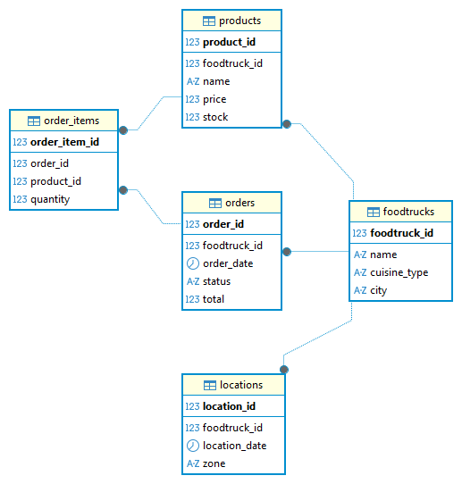

## 📄 Descripción del ProyectoFoodTrack: Gestión de Operaciones de Food Trucks

### Este repositorio contiene el diseño e implementación del esquema relacional inicial para FoodTrack, una plataforma orientada a centralizar y gestionar las operaciones de camiones de comida en entornos urbanos.

## 🚀 Tecnologías Utilizadas
Motor de Base de Datos: Microsoft SQL Server

Cliente de Gestión: DBeaver

Control de Versiones: Git & GitHub

## 📊 Diseño del Modelo Relacional
El esquema está diseñado para soportar la trazabilidad completa desde la oferta del producto hasta la entrega final en un punto específico.

Entidades Principales:
FoodTrucks: Registro de unidades móviles, tipos de cocina y estado.

Productos: Catálogo de alimentos y bebidas con sus respectivos precios.

Ubicaciones: Puntos geográficos autorizados en la ciudad donde operan los camiones.

Pedidos: Cabecera de la transacción (fecha, cliente, ubicación de venta).

Detalle_Pedidos: Relación muchos a muchos que desglosa los productos y cantidades por cada orden.

## 🛠️ Instalación y Configuración
Clonar el repositorio:

Bash
git clone https://github.com/tu-usuario/foodtrack-sql.git

2.  **Conexión en DBeaver:**
    *   Crear una nueva conexión de tipo **MS SQL Server**.
    *   Ingresar credenciales de `localhost` o servidor remoto.
    *   Asegurarse de tener instalados los drivers correspondientes (DBeaver los descarga automáticamente).
3.  **Ejecución del Script:**
    *   Abrir el archivo `scripts/init_schema.sql` en el editor SQL de DBeaver.
    *   Ejecutar el script completo para generar las tablas y restricciones de integridad.

---

## 📂 Estructura del Proyecto

```text
├── docs/               # Documentación y Diagrama Entidad-Relación (DER)
├── scripts/            # Scripts SQL de creación (DDL) e inserción (DML)
│   ├── 01_schema.sql   # Definición de tablas y llaves
│   └── 02_data.sql     # Datos de prueba iniciales
└── .gitignore          # Archivos excluidos de Git (logs, temporales de DBeaver)
---
```
## 📝 Flujo de Trabajo (Git)

Para mantener un entorno profesional, cada cambio en el esquema debe seguir este flujo:

Modificar el script localmente.

Testear la ejecución en DBeaver.

git add .

git commit -m "feat: agregar tabla de categorías de productos"

git push origin main

---

## 📄 Documentación
